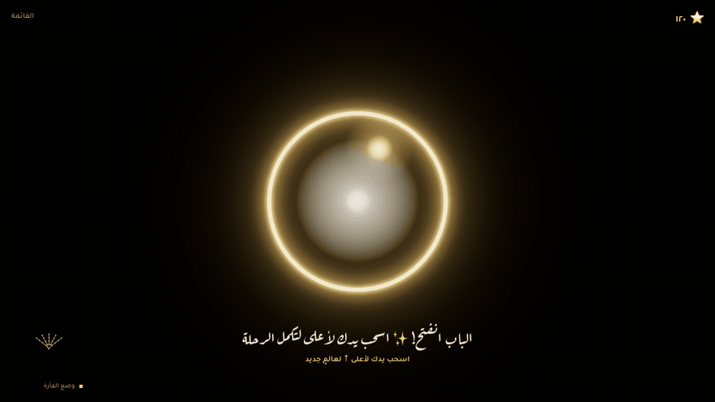
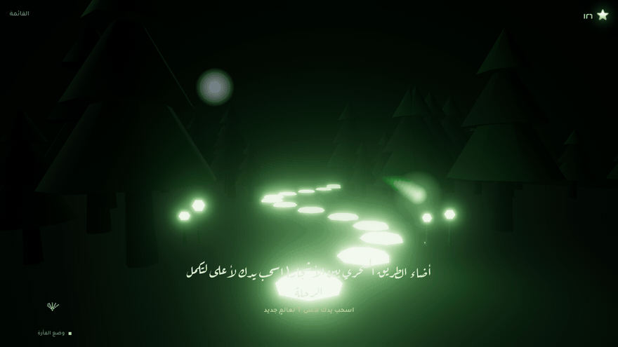
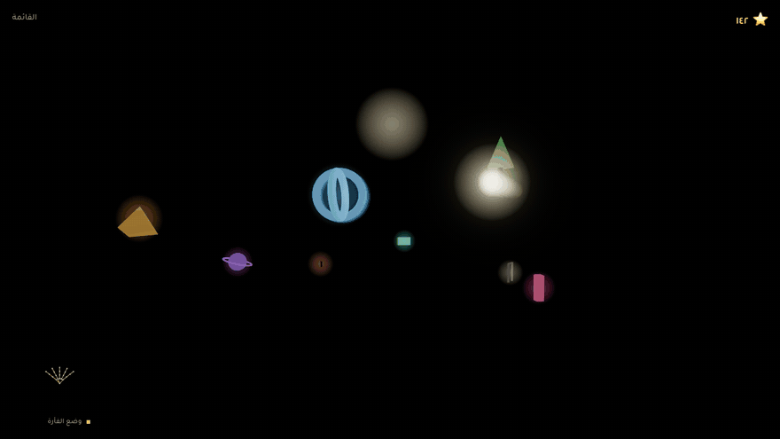
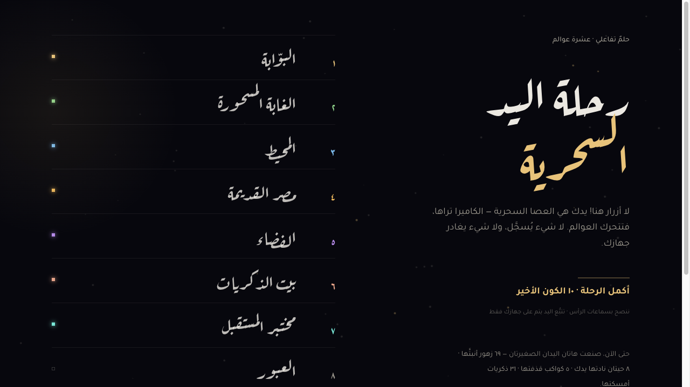
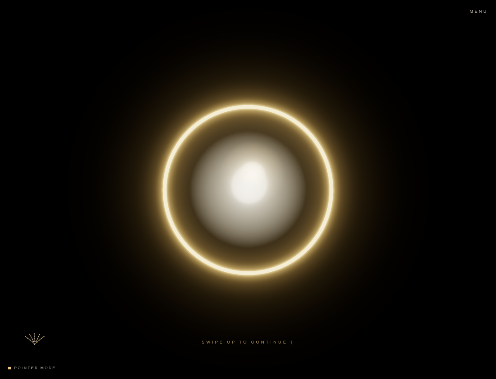

<div align="center">

# ✋ رحلة اليد السحرية
### The Hand Journey — an interactive dream controlled entirely by your hands

**عشرة عوالم. بلا أزرار. يدك هي العصا السحرية.**

[](https://journey.zad.tools)
[](https://ahmedvnabil.github.io/the-hand-journey/)


<br />



*ارفع كفّك المفتوح… الغبار يتجمّع، وبوّابة من نور تفتح الرحلة.*

</div>

---

## 🌍 التجربة | The Experience

الكاميرا ترى يدك — و**MediaPipe** يقرأ ٢١ مفصلًا منها ٣٠ مرة في الثانية، على جهازك بالكامل.
كل قرصة تزرع زهرة، كل تلويحة تُطيّر عصافير، وكل قبضة تثني الجاذبية.
لا شيء يُسجَّل، ولا شيء يغادر المتصفح.

Your webcam sees your hand, MediaPipe reads 21 landmarks of it on-device,
and a WebGPU dreamscape answers — pinches grow flowers, waves release birds,
a closed fist bends gravity. **No buttons anywhere.** Mouse/touch is only a fallback.

<div align="center">
<table>
<tr>
<td align="center" width="50%">
<br />
<sub>🌲 <b>الغابة المسحورة</b> — اقرص الهواء وستُولد زهرة من نور</sub>
</td>
<td align="center" width="50%">
<br />
<sub>🌌 <b>الكون الأخير</b> — كل العوالم التي لمستَها تدور حولك</sub>
</td>
</tr>
<tr>
<td align="center" width="50%">
<br />
<sub>📖 <b>فهرس العوالم</b> — تقدّمك ونجومك محفوظان دائمًا</sub>
</td>
<td align="center" width="50%">
<br />
<sub>🚪 <b>البوّابة</b> — أول عتبة في الحلم</sub>
</td>
</tr>
</table>
</div>

## 🗺️ العوالم العشرة | Ten Worlds

| | العالم | ماذا تتعلم يدك؟ |
|---|--------|------------------|
| ١ | **البوّابة** | ارفع كفّك — الغبار يصير بابًا من نور |
| ٢ | **الغابة المسحورة** | اقرص لتزرع زهورًا، لوّح لتطير العصافير |
| ٣ | **المحيط** | حرّك الموج، نادِ الحيتان، استدعِ مغامرة المطر والبرق |
| ٤ | **مصر القديمة** | أشِر للأبواب المختومة، أمسك الجعران الذهبي ودوّره |
| ٥ | **الفضاء** | أمسك الكواكب، اقذفها، أغلق قبضتك فتُولد دوّامة النجوم |
| ٦ | **بيت الذكريات** | اقرص الذكريات الطائرة قبل أن تذوب |
| ٧ | **مختبر المستقبل** | حرّك الهولوجرام وامسح البيانات بيديك الاثنتين |
| ٨ | **العبور** | فصلٌ هادئ مهيب — افتح الأبواب، ودفّئ قلوب الغرباء |
| ٩ | **مدينة المستقبل** | ارفع الأبراج، حوّل النهار ليلًا بكفّك |
| ١٠ | **الكون الأخير** | كل ما تعلمته… معًا، ووداعٌ مكتوب من رحلتك أنت |

أكمل عالمًا ثم **اسحب يدك لأعلى** لتسافر. كل إنجاز = ⭐ والحكواتي يقرأ لك التلميحات بالعربي.

## ✨ الإيماءات | Gestures

كف مفتوح · قبضة · قرصة · إشارة · سحب (٤ اتجاهات) · تثبيت · مسك · إفلات · تلويح · دوران المعصم · فرد اليدين · قرب/بُعد من الكاميرا

Smoothed with One-Euro filters, extrapolated through dropped frames, tuned
with a real child's hands — pinch has hysteresis (easy in, hard to lose),
and a fling that exits the camera frame still counts as a swipe.
Full heuristics: [docs/GESTURES.md](docs/GESTURES.md)

## 🚀 التشغيل | Quick Start

```bash
bun install
bun run dev        # http://localhost:3000 — اسمح للكاميرا
```

- `/` — فهرس العوالم · `/journey?world=space` — دخول مباشر لأي عالم
- بدون كاميرا: الفأرة/اللمس (ضغطة = قرصة، مطوّلة = قبضة، العجلة = عمق)
- كيبورد: `←→` تنقّل · `N` تخطٍّ · `F` ملء الشاشة · `P` صورة

## 📦 النشر | Deployment

```bash
./deploy.sh            # build + rsync → https://journey.zad.tools (CloudPanel VPS)
./deploy.sh --dry-run  # عرض التغييرات فقط
./deploy.sh --rollback # استرجاع آخر نسخة
git push               # → auto-deploys the GitHub Pages mirror via Actions
```

Static output, zero backend — any HTTPS host works. Details: [docs/DEPLOYMENT.md](docs/DEPLOYMENT.md)

## 🏗️ تحت الغطاء | Under the Hood

**Nuxt 4 · Bun · TypeScript · Three.js `WebGPURenderer`** (WebGPU with automatic
WebGL2 fallback — one TSL node-material pipeline for both) · **bloom + motion-blur**
post · **MediaPipe Tasks Vision** hand landmarker · **GSAP** scoped per scene ·
procedural **Web Audio** soundtrack (zero audio files) · quality governor that
auto-downgrades below 45fps · lazy per-world chunks · **PWA**.

- [docs/ARCHITECTURE.md](docs/ARCHITECTURE.md) — engines, frame loop, scene lifecycle
- [docs/SCENE_CONTRACT.md](docs/SCENE_CONTRACT.md) — how to write world № 11
- [docs/PERFORMANCE.md](docs/PERFORMANCE.md) — the 60fps playbook

## 🔒 الخصوصية | Privacy

تتبع اليد يعمل **على جهازك بالكامل** — لا يغادر أي إطار فيديو المتصفح أبدًا.
Hand tracking runs fully on-device; no video frame ever leaves the browser.
The only persistence is a local `localStorage` save of your progress and stars.

---

<div align="center">
<sub>صُنعت بيدين — على أمل أن تُلعب بأيادٍ صغيرة ✋⭐</sub>
</div>
